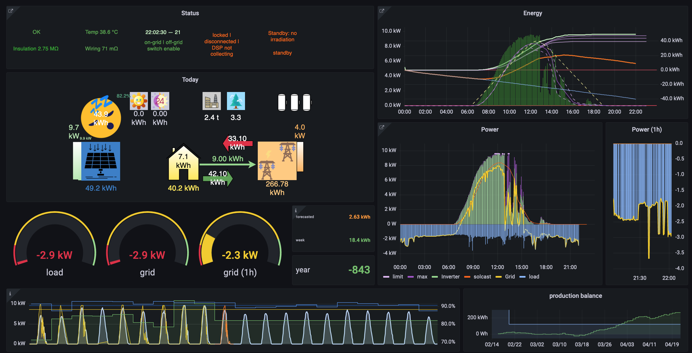
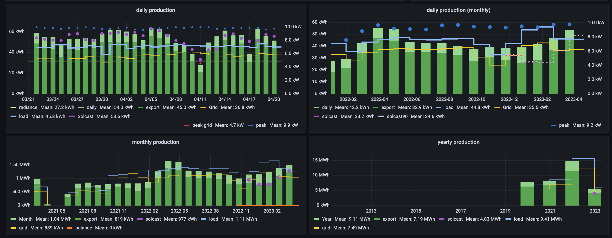
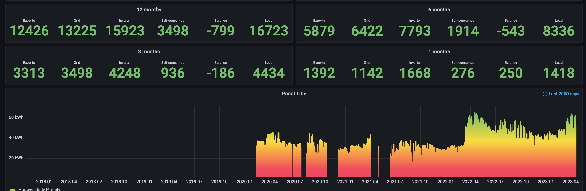

## Solar Logger

This is a datalogger for a solar inverter. Tried to make it so it can be used with any other inverter, if you create a file with all the register and status constants






I'm certain that by not having access to other inverters and only knowing mine, I did throw in some bias into the code. However, hope it isn't bad

So for now it is configured for Huawei's Sun2000 usl0 version but probably should run with other residential models. For commercial models, you would need to update the register map (in Huawei.py).

This code was inspired by a series of other repositories as a guideline to create the current datalogger. Including portions from https://github.com/meltaxa/solariot/

### Changes ###
Updated the dashboards to use timezone better
Improved the inverter connection (previous commit)
Some issues fixed

### Basics ###

You will need these python packages pymodbus, influxdb, pytz, and influxdb (the database itself), and grafana (needs 8 or higher). Read the setting_up.md for the full list.

Also included is the solcast folder from basking-in-the-sun2000/Radiation

For grafana you will need some plugins/ You can install them using:

```
sudo grafana-cli plugins install fetzerch-sunandmoon-datasource
sudo grafana-cli plugins install blackmirror1-singlestat-math-panel
sudo grafana-cli plugins install yesoreyeram-boomtable-panel
sudo grafana-cli plugins install agenty-flowcharting-panel
sudo systemctl restart grafana-server.service
```


Some of the inverters don't work well after sunset, they disable all functions. So you might need to test the logger during sun-up.


### Description of files ###

- `write_solar` populates the DB with expected production values. These are daily averages for the month in kWh. The values should account for your system, layout, shadowing, depreciation, etc, throughout the life of the system. This was used before solcast but gives you an idea of how your production is going. Also as solcast adjusts to your daily production, it gives you a fixed reference

- `scanner` should allow polling the inverter for valid registers

- `scanner2` will display the values of the registers listed in regs

- `fill_solcast_measurements` sends the recorded data from the inverter to solcast

- `balance.py` update the balance field

- `modbustcp` utility for Modbus

- `last_adjustment` allows to adjust the total energy balance (exported - from_grid + adj). Just fill the values (date and deviation in kWh)
	- There is an adjustment in the config file (extra_load) to allow you to have a daily adjustment (this isn't used hourly, but only for the daily values)

- `Huawei.default` contains the inverter's registers, status constants. If you would be using a different inverter, this would serve as a template. It copies this onto `Huawei.py` if you don't have one

- `HuaweiEnt.default.py` is the file for the commercial inverters

- `fill_daily_blanks` takes the data from the inverter (influxdb) and writes daily summaries. It now uses the 5m data (logger_ds), unlike the equivalent in the main file use 30s data from that day

- `config.default` has the constant values for your site. It copies this onto `config.py` if you don't have one

- `main` is the code that runs all the time to gather and store data onto the database (influxdb)

- `supla_api` is the api to the supla monitoring service (https://www.supla.org/en/)

- `utils` is a library with support utilities

- `divert.py` has the load diverting code. This version will turn off lower priority loads in favor of a higher priority one

- `divert1.py` has the load diverting code. This version will turn on/off loads depending on their priority, but will not turn them off in favor of a higher priority one.

- `email.py` the mail sending code

- `solar.service.app` has the values to set the logger as a service

- `setting_up.md` gives a detailed install to get up and running


#### Grafana files:
Import the dashboards in the Dashboards > Browse > Import (button on the right top)
- `dashboard.json` is the main dashboard for the logger
	- Will ask for you to set the variables besides the db locations
		- tzone - your local timezone
		- solcast_adj - if you need to adjust the forecast,  1.0 doesn't change it
		- peak_I - the maximum current the inverter produces
- `Solar.json` is the detail view dashboard for the logger
- `Status.json` shows the historical values of the status registers
- `loads.json` shows information about the loads for the diverter
- `info.json` provides a snapshot of the current values of the inverter
 - `data_sources.json` has information to setup the data sources for grafana

### Setup

After installing influxdb, grafana, the required python packages, and grafana plugins, you might want to change the `config.py` values to suit your installation.
You need to connect to the data sources in grafana. Influxdb creates three DBS: logger, logger_ds, and logger_lt (or the names you used if you changed those).

#### Don't forget to set up the config.py file according to your site's values
#### If you use a dongle, change slave to match your inverter

 
### Operation

Running shouldn't need much if all the requirements are satisfied
- cd to the directory with the code
- `python3 main.py`

If everything is working, you can get it running as a service and will autostart after booting. See [setting_up.md](setting_up.md)

###Notes about the Grafana dashboard
You will need to adjust the limits, thresholds, and other values according to your site. The values for the coloring make sense for mine, but you might need to adjust according to your needs. For instance, 40 kWh a day is great for me, but a mediocre day for you or might be too high for your system

There is a timezone variable, that you need to change to your site.

The display convention is that positive numbers are energies you generated, and negative those that you consumed

### Notes about raspberry pi 4

Been running it off a raspberry pi 4 and has behaved well. Influx is a bit demanding, up to 40% of the CPU. Did eventually ran into trouble, since wal files had grown, and influxdb couldn't run (see below). You might want to turn off the vnc and desktop to conserve resources.

Also, my sd card started acting up (changes weren't saved to the drive). Ended up using an SSD, which hopefully will be enough for the next 25 years. On the positive side, it allowed me to do a clean install and test everything from scratch. Had to install it on the usb2. Wouldn't boot if it was on the usb3, maybe the case I'm using.

Did add this to the `/boot/cmdline.txt`, just to make sure it checked the drives at bootup
	fsck.mode=auto fsck.repair=yes

You should have the log file at `~/var/log/solar/solar.log` (unless you changed the location). but you need to create the folder first (mkdir)

You could also try something that moves a high-frequency write directory (`/var/log`) to ram
https://github.com/azlux/log2ram

### Diverter
#### In development, haven't tested it. You need to remove the lines marked as _disable for actual use_ in divert.py to be able to control loads.

Control loads to sink excess power. Don't have a setup to test this, so hope someone might provide some feedback. By not having tested it, I might have overcompensated for this

The load itself would have whatever logic it needs. So a water heater would need a thermostat, an A/C also a thermostat, an EV charger would need the logic to control the charge (though it is conceivable to add a PWM that would show the available excess power),  etc. This control only provides a signal that can be used to power the loads.

The logger runs every 30s, so it could be that in the previous iteration, a load was activated, but the load's logic turned it off. You would now have that power available and would activate a second load (assuming you have several). If during the next two and a half minutes these two loads activate, you won't be able to turn them off (there is a freeze of 3 minutes between events).

You have to set some parameters in the config file

__diverters__ — needs to be set to True to activate
__diverters_loads__ — defines the power consumed by each load

This is the average power consumed by the load. You probably don't want to consider the starting inrush, since it could skew the way the other loads work. This value tells how much power will change if this load is added or taken out of play. Since several loads can change at a time, this will help determine how the available power changed

__diverters_io__ — defines the interface (currently only gpio) and the pin numbers

__diverters_holiday__ Will disable a load until that day (yyyy-mm-dd). At the start of the day (0 hours) the load will become active and controlled by __divert__ and the load's controller

__divert__ — is a 24h profile for the loads. For each hour you define a tuple (load, priority, pstart, pstop).

__Load__ is the number (from 0) assigned to a load.

__priority__ defines how important the load is to you. The higher it is it will be tested first when activating and will turn off after the lower __priority__ loads.  Though the available power will determine if the load can be changed at that time.

A value of  -1 disables the load at that hour.


__pstart__ is the available power you need to have before the load turns on. The power at the grid (meter actually) has to be higher than __pstart.__ It is not the value of the power produced by the inverter, but the net result (your production - your consumption).

You want this to be larger than the actual load and the value for __diverters_loads.__ This will prevent the load from turning on/off when the available power is just enough. For instance __pstart__ is 1500W, __diverters_loads__ (the power used by the load) for is 1100W and __pstop__ is 500W. When the power drops below 500W (i.e. 450W), the load will be turned off. On the next iteration (3m later), you will have 450W from before, and the 1100W since the load is off, giving you 1550W available. This being larger than __pstart__, the load will turn on again. After that, it would probably have 400W again, and the load would deactivate again.

Since you could define values for nighttime (probably a negative value), you would still need the grid to be higher (i.e. a smaller negative number)


__pstop__ will deactivate the load when the power at the grid drops.

For nighttime loads, this value has to be the more negative of the two.

You want to provide a deadband between __pstart__ and __pstop,__ to prevent the system from chattering. It has to consider the load. So don't give a spread of 1kW when the load is 2kW (this might lead to some confusion by the controller). __pstart__ is larger than __pstop__, the load from __diverters_loads__ and then some extra.

For instance you might want for a 1200 W WH values to be __pstart__= 2200 (maybe larger if you have several other loads), __pstop__= 300 and __diverters_loads__ = 1200

Even when __priority__ will determine the order, the power settings have to be satisfied, for the load to change. However, the priority allows a load to be tested first. In the case where two loads have the same __priority__, then larger __pstart__ loads will be allowed to turn on first. This is the logic, however, the generated power increases in the morning, so probably smaller loads would be activated.

When turning off two loads with the same  __priority__, smaller __pstop__ loads are tested first. If you need a load to remain connected over all others, use a larger  __priority__ for this load.

#### Notes about diverters

There is a 3 minute period during which no changes are allowed after an event for that load. This is to prevent an inrush load from freaking out the controller and to prevent a nervous response. This could happen at the end of the day, or when it is very cloudy. Also if you are using a compressor as a load, you might want to increase this time.

A suggestion for resistive loads would be to use a zero-crossing relay. This would make the contactor last longer since it would commutate without a load. If your load is inductive, a zero-crossing might not work well

_Since I don't have a diverter, won't be able to test it. So based on experiences from those using it, maybe this can evolve to something useful_

Another approach for diverting power could be to activate the loads when the inverter's voltage is getting high. This might allow a drop in voltage because of the added load, and thus preventing your inverter from reducing its output power (see the volt-watt for your inverter). The load logic would still control the load, but as long as it can turn on, it should help if these are large enough loads.

Didn't implement this, since I want to make sure the regular concept for load diverting works first. Should anyone need it, let me know.

### Other notes

It uses solcast.com, so you need to create an account (free) and a rooftop site. It pulls the forecast several times during the day, but only sends the measurements at midnight.

Also updates the daily summary data at midnight. In case you missed that time, some tools allow you to send data to solcast or update the daily DB

After tuning (sending your data), they claim I'm getting a 0.97 correlation of the data. There is an adjustment factor in the Energy pane of grafana, for 0.98. With use, it will improve (solcast tuning has improved the forecasts a lot!). The time period is hardwired to 5 minutes, not sure it makes much difference if you use 10m or even 30m. However, since we are only sending data for the active production once a day, it sounded like a reasonable value.

In grafana, several limits show values in different colors. You can adjust these to suit your site. The solcast forecasts include all 3 sets. These are the regular, the 10th percentile (low scenario), and the 90th percentile (high scenario) estimates. If you rather, you can delete the ones that don't suit you.

My system is new, so I have panes that show the behavior throughout the day. If yours is older or doesn't care, you can swap the panes for daily behavior instead. Just scroll down and move the panes up, or make your own.


### About Influx

Just had an issue with influxdb, by which it wouldn't start. Somehow it didn't work as expected and started leaving around a huge amount of files. Had he logger offline a couple of days, trying to figure a way to fix it.

Got the 4GB raspberry pi, thinking I would need it. However, always thought that would suffice for this use. Eventually moved it to my computer, and ran influxd from there. Kept getting an out-of-memory error and later a too many files open error.

Not sure if this will suffice, but maybe these changes might help

Add to `/etc/security/limits.d/influxd.conf` and `/etc/security/limits.conf`:

    *                hard    nofile          40962
    *                soft    nofile          40962

Set these values to the influxdb config (`/etc/influxdb/influxdb.conf`), not certain they will solve the problem

```[meta]
  dir = "/var/lib/influxdb/meta"
[data]
  dir = "/var/lib/influxdb/data"
  wal-dir = "/var/lib/influxdb/wal"
  index-version = "tsi1"
  query-log-enabled = false
  cache-snapshot-memory-size = "64m"
  cache-snapshot-write-cold-duration = "15m"
  compact-full-write-cold-duration = "4h"
  max-concurrent-compactions = 1
  compact-throughput = "24m"
  compact-throughput-burst = "48m"
  max-index-log-file-size = "1m"
  ```

### create a continuous query

> `CREATE DATABASE logger_ds`

> `CREATE CONTINUOUS QUERY downsample_solar ON logger_ds BEGIN SELECT first(M_PExp) AS M_PExp, first(M_PTot) AS M_PTot, first(P_accum) AS P_accum, first(P_daily) AS P_daily, first(P_peak) AS P_peak, MEAN("M_A-I") AS "M_A-I", MEAN("M_A-U") AS "M_A-U", MEAN("M_B-I") AS "M_B-I", MEAN("M_B-U") AS "M_B-U", MEAN("M_C-I") AS "M_C-I", MEAN("M_C-U") AS "M_C-U", MEAN("U_A-B") AS "U_A-B", MEAN("η") AS "η", MEAN(Frequency) AS Frequency, MEAN(I_A) AS I_A, MEAN(M_Freq) AS M_Freq, MEAN(M_PF) AS M_PF, MEAN(M_U_AB) AS M_U_AB, MEAN(M_U_BC) AS M_U_BC, MEAN(M_U_CA) AS M_U_CA, MEAN(P_active) AS P_active, MEAN(P_reactive) AS P_reactive, MEAN(PF) AS PF, MEAN(PV_In) AS PV_In, MEAN(PV_P) AS PV_P, MEAN(PV_Un) AS PV_Un, MEAN(Temp) AS Temp, MEAN(U_A) AS U_A, MEAN(U_B) AS U_B, PERCENTILE("M_A-I", 20) AS "M_A-I_p20", PERCENTILE("M_A-I", 95) AS "M_A-I_p95", PERCENTILE("M_A-U", 20) AS "M_A-U_p20", PERCENTILE("M_A-U", 95) AS "M_A-U_p95", PERCENTILE("M_B-I", 20) AS "M_B-I_p20", PERCENTILE("M_B-I", 95) AS "M_B-I_p95", PERCENTILE("M_B-U", 20) AS "M_B-U_p20", PERCENTILE("M_B-U", 95) AS "M_B-U_p95", PERCENTILE("M_C-I", 20) AS "M_C-I_p20", PERCENTILE("M_C-I", 95) AS "M_C-I_p95", PERCENTILE("M_C-U", 20) AS "M_C-U_p20", PERCENTILE("M_C-U", 95) AS "M_C-U_p95", PERCENTILE("U_A-B", 20) AS "U_A-B_p20", PERCENTILE("U_A-B", 95) AS "U_A-B_p95", PERCENTILE(I_A, 20) AS I_A_p20, PERCENTILE(I_A, 95) AS I_A_p95, PERCENTILE(M_PF, 20) AS M_PF_p20, PERCENTILE(M_PF, 95) AS M_PF_p95, PERCENTILE(M_U_AB, 20) AS M_U_AB_p20, PERCENTILE(M_U_AB, 95) AS M_U_AB_p95, PERCENTILE(M_U_BC, 20) AS M_U_BC_p20, PERCENTILE(M_U_BC, 95) AS M_U_BC_p95, PERCENTILE(M_U_CA, 20) AS M_U_CA_p20, PERCENTILE(M_U_CA, 95) AS M_U_CA_p95, PERCENTILE(P_active, 20) AS P_active_p20, PERCENTILE(P_active, 95) AS P_active_p95, PERCENTILE(P_reactive, 20) AS P_reactive_p20, PERCENTILE(P_reactive, 95) AS P_reactive_p95, PERCENTILE(PV_In, 20) AS PV_In_p20, PERCENTILE(PV_In, 95) AS PV_In_p95, PERCENTILE(PV_P, 20) AS PV_P_p20, PERCENTILE(PV_P, 95) AS PV_P_p95, PERCENTILE(PV_Un, 20) AS PV_Un_p20, PERCENTILE(PV_Un, 95) AS PV_Un_p95, PERCENTILE(U_A, 20) AS U_A_p20, PERCENTILE(U_A, 95) AS U_A_p95, PERCENTILE(U_B, 20) AS U_B_p20  , PERCENTILE(U_B, 95) AS U_B_p95, MEAN("M_A-P") + 0.00001 AS "M_A-P", MEAN("M_B-P") + 0.00001 AS "M_B-P", MEAN("M_C-P") + 0.00001 AS "M_C-P", MEAN(M_P) + 0.00001 AS M_P, MEAN(M_Pr) + 0.00001 AS M_Pr, PERCENTILE("M_A-P", 20) + 0.00001 AS "M_A-P_p20", PERCENTILE("M_A-P", 95) + 0.00001 AS "M_A-P_p95", PERCENTILE("M_B-P", 20) + 0.00001 AS "M_B-P_p20", PERCENTILE("M_B-P", 95) + 0.00001 AS "M_B-P_p95", PERCENTILE("M_C-P", 20) + 0.00001 AS "M_C-P_p20", PERCENTILE("M_C-P", 95) + 0.00001 AS "M_C-P_p95", PERCENTILE(M_P, 20) + 0.00001 AS M_P_p20, PERCENTILE(M_P, 95) + 0.00001 AS M_P_p95, PERCENTILE(M_Pr, 20) + 0.00001 AS M_Pr_p20, PERCENTILE(M_Pr, 95) + 0.00001 AS M_Pr_p95 INTO logger_ds.autogen.Huawei FROM logger.autogen.Huawei GROUP BY time(5m) END`


If you already have your logger running, before doing the next step you need to populate the logger_ds with the older data (CQ only does current data). Just ran from the query (within the begin and end limiters of the cq)

add a retention policy (this will delete anything older than 70 days from the 30s data. You should get 5m data from the cq)

    ALTER RETENTION POLICY autogen on logger DURATION 70d REPLICATION 1 SHARD DURATION 15d DEFAULT
