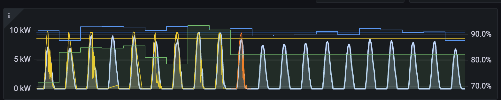
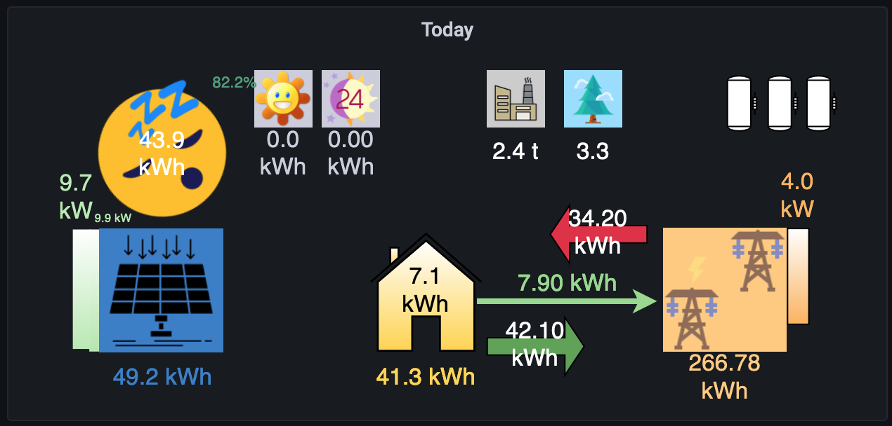
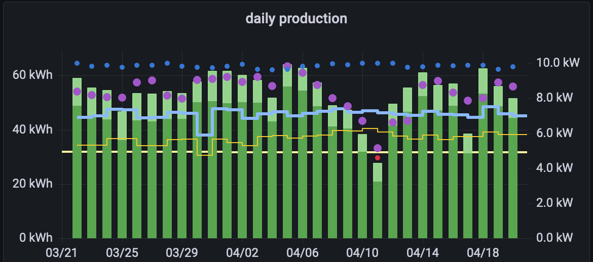

To improve the forecast, the logger now includes a built-in system that continuously adjusts solcast forecasts. It uses the Holt-Winters method, an exponential smoother to predict future values based on past data.

The Holt-Winters method compares the actual production to the forecast to improve the daily forecast. Thus more closely matching the actual production values during the past week. However, since it uses a week of data, it takes about a week for changes to propagate in the adjustment. Whether it was rain, washing of the solar panels, an outage, or any other perturbance, the actual forecast will keep adjusting during the week to improve the forecast.

This works without further user input, beyond some changes in the config.py file. Unlike a fixed adjustment, now it will try to compensate for external values that vary slowly.

You might want to keep an eye on the adjustment since it can point to a problem with the system. For instance dirty panels, shading that normally isn't present, etc.

Below you can see that the adjustment is shown in the daily panel. Look for the small value next to the yet possible forecast (the happy sun)

Though it seems to be working better, there are days that don't match well. When it is cloudy, the forecast doesn't match well. Usually solecist's forecast will be more optimistic, than the actual production

